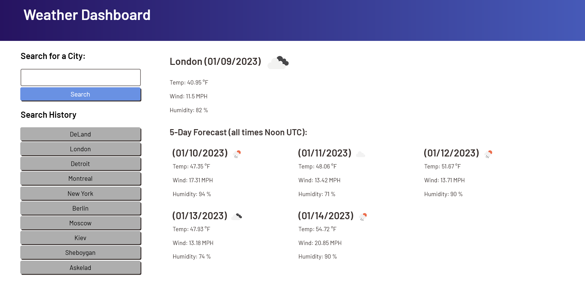

# Weather-Dashboard

## Description

The purpose of this program is to access data from a 3rd party API (such as OpenWeatherMap) and display it on a webpage of your own. This code utilizes bootstrap for the HTML structure, as well as the fetch API for accessing data from a 3rd party, and also localStorage to save the user's search history and display it back on the page. This program also uses dayjs to convert unix time recieved in data from the 3rd party API into a readable UTC time object.

This program utilizes different web development aspects such as: JavaScript (Event Listeners, DOM Manipulation), Bootstrap (Grid), dayjs, localStorage, Google Web Fonts

## Link

This is a link to the project hosted on GitHub Pages: [https://jcherwin.github.io/Weather-Dashboard/](https://jcherwin.github.io/Weather-Dashboard/)

## Usage

This image is an example of what to expect when viewing the complete webpage.

